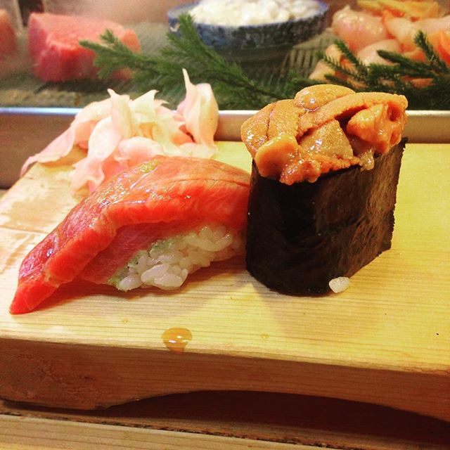

Since friends are often asking me for my travel itinerary, I figured I would put it all in one place to make it easier to access.  It's still a work in progress, but Oregon will be coming soon, and stay tuned for tips in France, Hawai'i, and more.  Welcome to WahineTravels!

<article class="splash" itemscope="" itemtype="https://schema.org/CreativeWork">
  <meta itemprop="headline" content="Splash Page">
  <meta itemprop="description" content="Bacon ipsum dolor sit amet salami ham hock ham, hamburger corned beef short ribs kielbasa biltong t-bone drumstick tri-tip tail sirloin pork chop.">
  <meta itemprop="datePublished" content="2016-03-23T11:48:41-04:00">
    <section class="page__content" itemprop="text">

  

    

      

        
      

      

        <h2 class="archive__item-title">
          <a href="japan/" rel="permalink">Japan</a>
        </h2>
      

    

  

  

    

      

        
      

      

        <h2 class="archive__item-title">
          <a href="/oregon/" rel="permalink">Oregon</a>
        </h2>
      

    

  

  

    

      

        
      

      

        <h2 class="archive__item-title">
          <a href="/hawaii/" rel="permalink">Hawai'i</a>
        </h2>
      

    

  

